## 플랫폼 서비스 UseCase 개요
> 전자정부 클라우드 플랫폼 서비스의 Use case를 설명합니다.

 

---

## 1. 개발환경 구성

### 1.1. 프로젝트 관리, 형상관리, CI/CD

**1\) 아키텍처 소개**

- 가장 일반적인 클라우드 기반 개발환경을 구성하는 경우에 필요한 도구를 제공
- 웹 기반 프로젝트 관리와 버그 추적 기능을 제공하는 Redmine과 GIT과 SVN을 지원하는 형상관리 서비스, 지속적인 통합, 지속적인 배포를 제공하는 배포 파이프 라인을 제공

 

**2\) 아키텍처 구성**

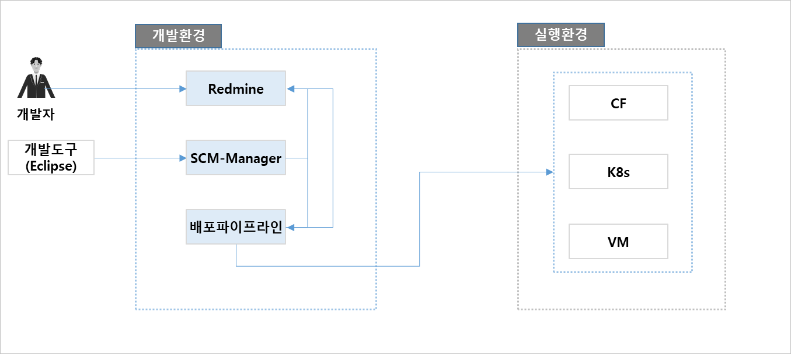

 

**3\) 연관 플랫폼 서비스**

| **구성요소** | **플랫폼 서비스** | **비고** |
| ------- | ----------- | ---- |
| 프로젝트 관리 | Redmine | |
| 형상관리 | SCM-Manager | |
| CI/CD | 배포파이프라인 | |

  

### 1.2. 디지털 원패스/GPKI 인증 기능 추가

**1\) 아키텍처 소개**

- 가장 일반적인 클라우드 기반 개발환경을 구성하고 인증 서비스를 추가하고자 하는 경우에 적용하는 구성
- 디지털 원패스 기능이나 GPKI 인증서비스 기능을 적용하여 홈페이지 인증 기능을 추가

 

**2\) 아키텍처 구성**

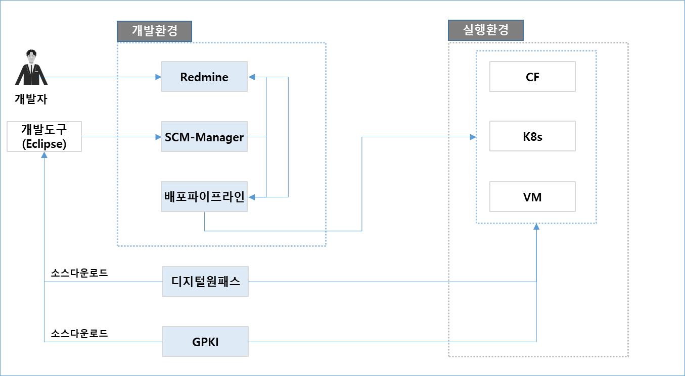

 

**3\) 연관 플랫폼 서비스**

| **구성요소**       | **플랫폼 서비스**         | **비고** |
| ------------------ | ------------------------- | -------- |
| 프로젝트 관리      | Redmine                   |          |
| 형상관리           | SCM-Manager               |          |
| CI/CD              | 배포파이프라인            |          |
| 디지털원패스서비스 | 디지털원패스 on OpenStack |          |
| GPKI 서비스        | GPKI on OpenStack         |          |

  

### 1.3. 성능 모니터링이 필요한 경우

**1\) 아키텍처 소개**
- 가장 일반적인 클라우드 기반 개발환경을 구성하고 성능 모니터링과 업무시스템 이용통계를 적용하는 구성
- Pinpoint APM과 업무 시스템 이용통계를 적용하여 어플리케이션 성능 모니터링, 이용통계 구현

 

**2\) 아키텍처 구성**

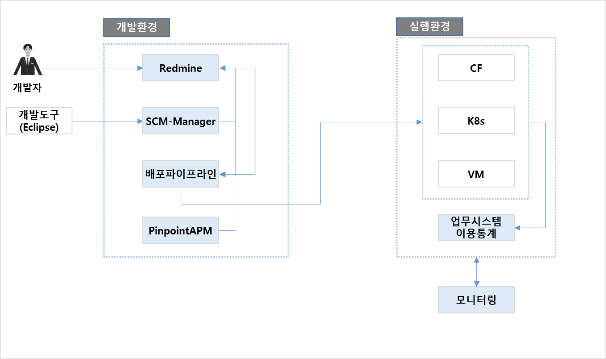

 

**3\) 연관 플랫폼 서비스**

| **구성요소**                  | **플랫폼 서비스**       | **비고**         |
| ----------------------------- | ----------------------- | ---------------- |
| 프로젝트 관리                 | Redmine                 |                  |
| 형상관리                      | SCM-Manager             |                  |
| CI/CD                         | 배포파이프라인          |                  |
| 성능 분석 및 문제 진단 서비스 | Pinpoint APM            |                  |
| 업무시스템 이용통계           | 통계관리 on OpenStack   |                  |
| 모니터링                      | 장애∙성능/로그 대시보드 | 플랫폼 기본 제공 |

  

### 1.4. 로그인 권한관리 기능 적용 개발

**1\) 아키텍처 소개**

- 가장 일반적인 클라우드 기반 개발환경을 구성하고 로그인 사용자관리, 정책관리, 권한관리 기능을 적용한 업무 개발 환경을 구성

 

**2\) 아키텍처 구성**

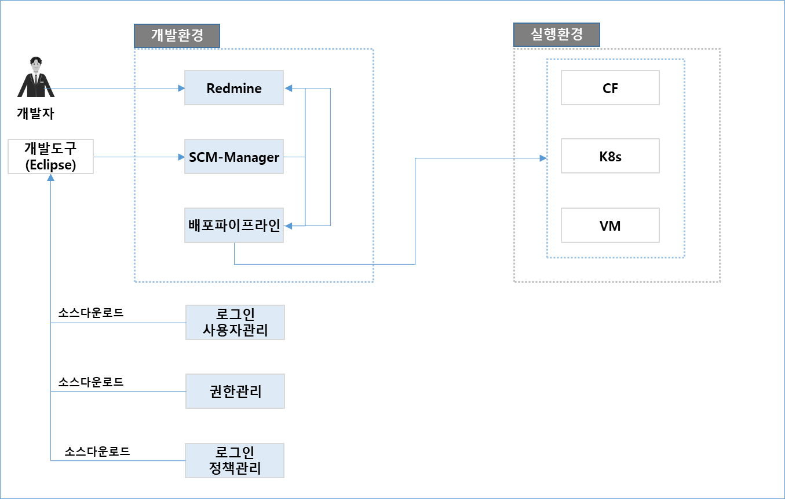

 

**3\) 연관 플랫폼 서비스**

| **구성요소**      | **플랫폼 서비스** | **비고** |
| ----------------- | ----------------- | -------- |
| 프로젝트 관리     | Redmine           |          |
| 형상관리          | SCM-Manager       |          |
| CI/CD             | 배포파이프라인    |          |
| 로그인 사용자관리 | 로그인 사용자관리 |          |
| 권한관리          | 권한관리          |          |
| 로그인 정책관리   | 로그인 정책관리   |          |

  

### 1.5. 인공지능 서비스 개발환경 아키텍처

**1\) 아키텍처 소개**

- 인공지능 서비스 개발환경을 구성하기 위한 서비스 조합
- Jupyter Notebook 개발환경에 프로젝트 관리와 형상관리 기능을 연계하는 구성

 

**2\) 아키텍처 구성**

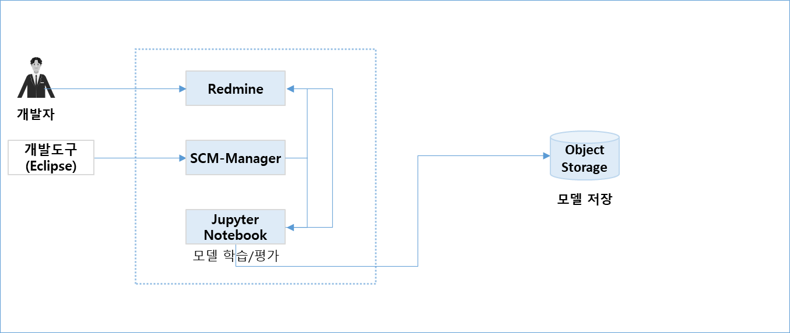

 

**3\) 연관 플랫폼 서비스**

| **구성요소**      | **플랫폼 서비스**             | **비고**                             |
| ----------------- | ----------------------------- | ------------------------------------ |
| 인공지능 개발환경 | Jupyter Notebook              | 소규모 인공지능 개발 환경            |
|                   | Jupyter Notebook on OpenStack | 입주기관 단독 사용 인공지능 개발환경 |
| 프로젝트 관리     | Redmine                       |                                      |
| 형상관리          | SCM-Manager                   |                                      |
| 외부저장소        | Object Storage on OpenStack   |                                      |

  

### 1.6.  레거시 어플리케이션을 위한 개발/운영환경 아키텍처

**1\) 아키텍처 소개**

- 레거시 어플리케이션 개발을 위한 프로젝트 관리, 형상관리 서비스와 웹, WAS, DB의 운영환경을 위한 서비스 조합

 

**2\) 아키텍처 구성**

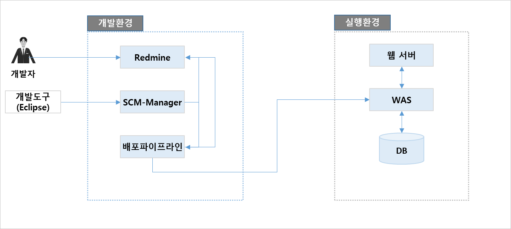

 

**3\) 연관 플랫폼 서비스**

| **구성요소**      | **플랫폼 서비스**                    | **비고** |
| ----------------- | ------------------------------------ | -------- |
| 오픈소스 웹서버   | Nginx(Ubuntu16.04) on OpenStack      |          |
|                   | Apache(Ubuntu 16.04) on OpenStack    |          |
| 오픈소스 WAS 서버 | Tomcat(Ubuntu16.04) on OpenStack     |          |
|                   | JBoss(Ubuntu16.04) on OpenStack      |          |
| 오픈소스 DBMS     | MariaDB(Ubuntu16.04) on OpenStack    |          |
|                   | PostgreSQL(Ubuntu16.04) on OpenStack |          |
| 프로젝트 관리     | Redmine                              |          |
| 형상관리          | SCM-Manager                          |          |
| CI/CD             | 배포파이프라인                       |          |

 

---

## 2. 웹호스팅

### 2.1. 일반적인 레거시(WEB, WAS, DB) 환경의 서비스 조합 (Ubuntu 환경)

**1\) 아키텍처 소개**

- Ubuntu 환경의 전형적인 WEB, WAS, DB 기반의 어플리케이션 실행 환경을 구성하기 위한 서비스 조합

 

**2\) 아키텍처 구성**

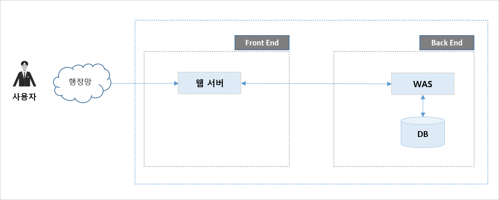

 

**3\) 연관 플랫폼 서비스**

| **구성요소**           | **플랫폼 서비스**                    | **비고** |
| ---------------------- | ------------------------------------ | -------- |
| Ubuntu 기반의 웹서버   | Nginx(Ubuntu16.04) on OpenStack      |          |
|                        | Apache(Ubuntu 16.04) on OpenStack    |          |
| Ubuntu 기반의 WAS 서버 | Tomcat(Ubuntu16.04) on OpenStack     |          |
|                        | JBoss(Ubuntu16.04) on OpenStack      |          |
| Ubuntu 기반의 DBMS     | MariaDB(Ubuntu16.04) on OpenStack    |          |
|                        | PostgreSQL(Ubuntu16.04) on OpenStack |          |

  

### 2.2. 일반적인 레거시(WEB, WAS, DB) 환경의 서비스 조합 (CentOS 환경)

**1\) 아키텍처 소개**

- CentOS 환경의 전형적인 WEB, WAS, DB 기반의 어플리케이션 실행 환경을 구성하기 위한 서비스 조합

 

**2\) 아키텍처 구성**

 

**3\) 연관 플랫폼 서비스**

| **구성요소**           | **플랫폼 서비스**                | **비고** |
| ---------------------- | -------------------------------- | -------- |
| CentOS 기반의 웹서버   | Nginx(CentOS7) on OpenStack      |          |
|                        | Apache(CentOS7) on OpenStack     |          |
| CentOS 기반의 WAS 서버 | Tomcat(CentOS7) on OpenStack     |          |
|                        | JBoss(CentOS7) on OpenStack      |          |
| CentOS 기반의 DBMS     | MariaDB(CentOS7) on OpenStack    |          |
|                        | PostgreSQL(CentOS7) on OpenStack |          |

  

### 2.3. Load Balancer를 적용하여 부하 분산

**1\) 아키텍처 소개**

- 서비스의 규모가 커지고 사용자 수가 늘어나고 다양한 지역의 사용자들이 서비스를 사용하는 경우 부하 분산

 

**2\) 아키텍처 구성**

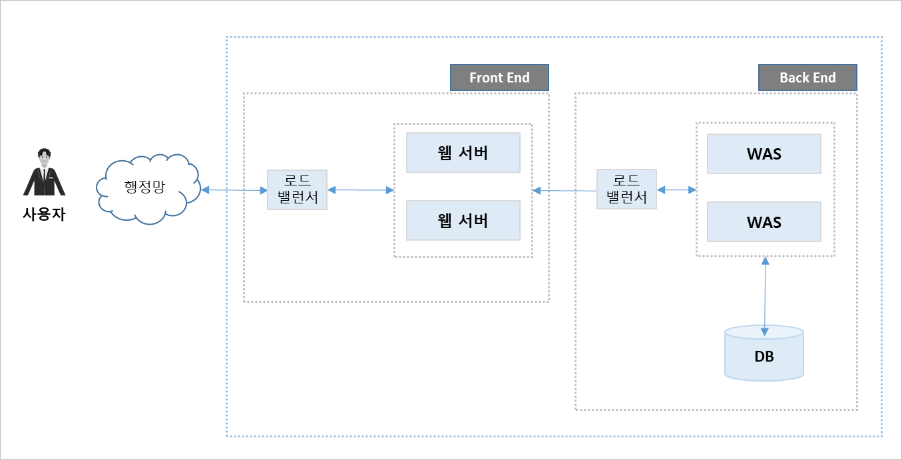

 

**3\) 연관 플랫폼 서비스**

| **구성요소**      | **플랫폼 서비스**                    | **비고** |
| ----------------- | ------------------------------------ | -------- |
| 오픈소스 웹서버   | Nginx(Ubuntu16.04) on OpenStack      |          |
|                   | Apache(Ubuntu 16.04) on OpenStack    |          |
| 오픈소스 WAS 서버 | Tomcat(Ubuntu16.04) on OpenStack     |          |
|                   | JBoss(Ubuntu16.04) on OpenStack      |          |
| 오픈소스 DBMS     | MariaDB(Ubuntu16.04) on OpenStack    |          |
|                   | PostgreSQL(Ubuntu16.04) on OpenStack |          |
| 네트워크          | 로드밸런서                           |          |

  

### 2.4. Auto Scaling을 적용하여 가용성 확보

**1\) 아키텍처 소개**

- 대규모 웹사이트를 구축하는 경우나 특정 이벤트의 요청이 폭주하는 경우에 대비하여 Auto Scaling 기능을 적용

 

**2\) 아키텍처 구성**

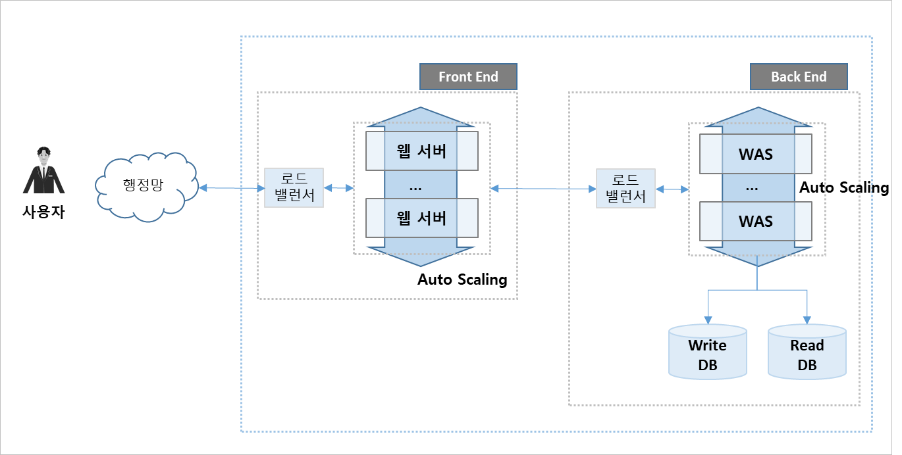

 

**3\) 연관 플랫폼 서비스**

| **구성요소**      | **플랫폼 서비스** | **비고** |
| ----------------- | ----------------- | -------- |
| 오픈소스 웹서버   | Nginx             |          |
|                   | Apache            |          |
| 오픈소스 WAS 서버 | Tomcat            |          |
|                   | JBoss             |          |
| 오픈소스 DBMS     | MariaDB           |          |
|                   | PostgreSQL        |          |
| 네트워크          | 로드밸런서        |          |

  

### 2.5. 소규모 웹사이트 구성

**1\) 아키텍처 소개**

- 소규모 웹사이트를 구축한다면 1vCPU, 2GB의 메모리를 가진 Small 플랜의 공통시스템 SW를 선택하여 서비스 가능
- 서비스 사용자가 점차 많아 진다면 서버를 추가하고 로드밸런서를 연결하여 부하를 분산시키는 것도 몇 번의 클릭만으로 쉽게 가능

 

**2\) 아키텍처 구성**

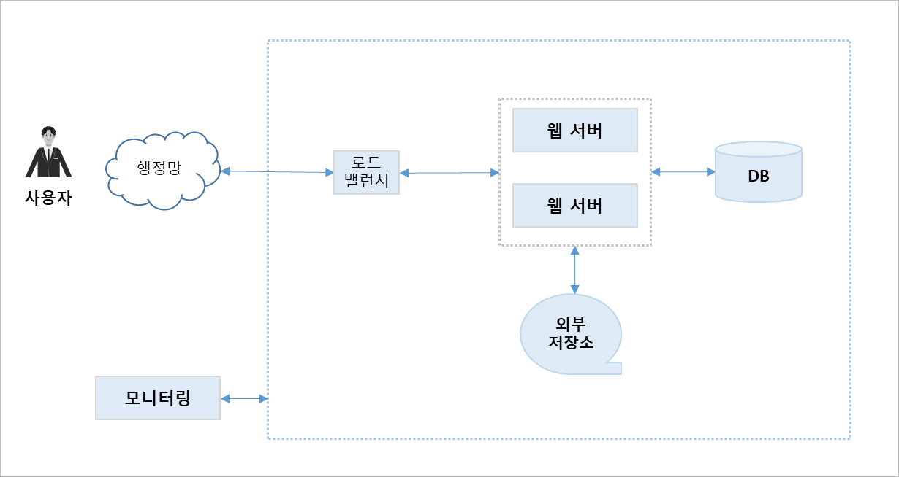

 

**3\) 연관 플랫폼 서비스**

| **구성요소**  | **플랫폼 서비스**                    | **비고**         |
| ------------- | ------------------------------------ | ---------------- |
| 웹서버        | Nginx(Ubuntu16.04) on OpenStack      |                  |
|               | Apache(Ubuntu 16.04) on OpenStack    |                  |
| 오픈소스 DBMS | MariaDB(Ubuntu16.04) on OpenStack    |                  |
|               | PostgreSQL(Ubuntu16.04) on OpenStack |                  |
| 외부저장소    | Object Storage on OpenStack          |                  |
| 네트워크      | 로드밸런서                           |                  |
| 모니터링      | 장애∙성능/로그 대시보드              | 플랫폼 기본 제공 |

  

### 2.6. 전자상거래 사이트 구축

**1\) 아키텍처 소개**

- 전자상거래 사이트는 보안 위협으로부터 안전해야 하고, 예측 불가능한 수요에도 대비가 필요 
- 갑작스러운 트래픽 증가에도 유연하게 대처할 수 있도록 Auto Scaling 기능이 적용되어야 하며 Payment Gateway 등 외부 서비스 연계를 위해 API Gateway 적용도 필요

 

**2\) 아키텍처 구성**

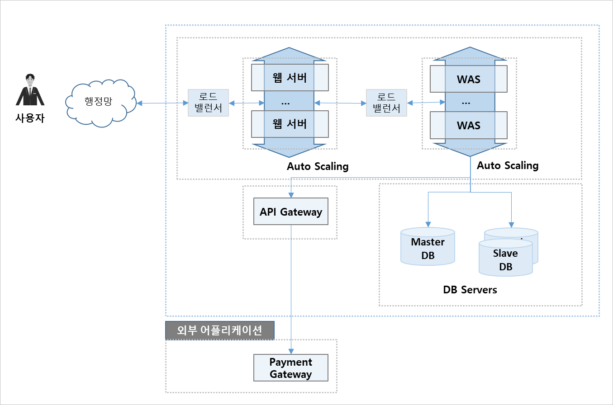

 

**3\) 연관 플랫폼 서비스**

| **구성요소**      | **플랫폼 서비스**                    | **비고** |
| ----------------- | ------------------------------------ | -------- |
| 오픈소스 웹서버   | Nginx(Ubuntu16.04) on OpenStack      |          |
|                   | Apache(Ubuntu 16.04) on OpenStack    |          |
| 오픈소스 WAS 서버 | Tomcat(Ubuntu16.04) on OpenStack     |          |
|                   | JBoss(Ubuntu16.04) on OpenStack      |          |
| 오픈소스 DBMS     | MariaDB(Ubuntu16.04) on OpenStack    |          |
|                   | PostgreSQL(Ubuntu16.04) on OpenStack |          |
| Cache             | Redis on OpenStack                   |          |
| 네트워크          | 로드밸런서                           |          |
| 연계서비스        | API Gateway                          |          |

  

### 2.7. 하이브리드 클라우드 호스팅

**1\) 아키텍처 소개**

- 기존 레거시 자원과 클라우드 플랫폼의 자원을 통합하여 이용하는 환경
- 개인 정보 등 민감 정보는 내부에 유지하면서 클라우드 서비스 활용

 

**2\) 아키텍처 구성**

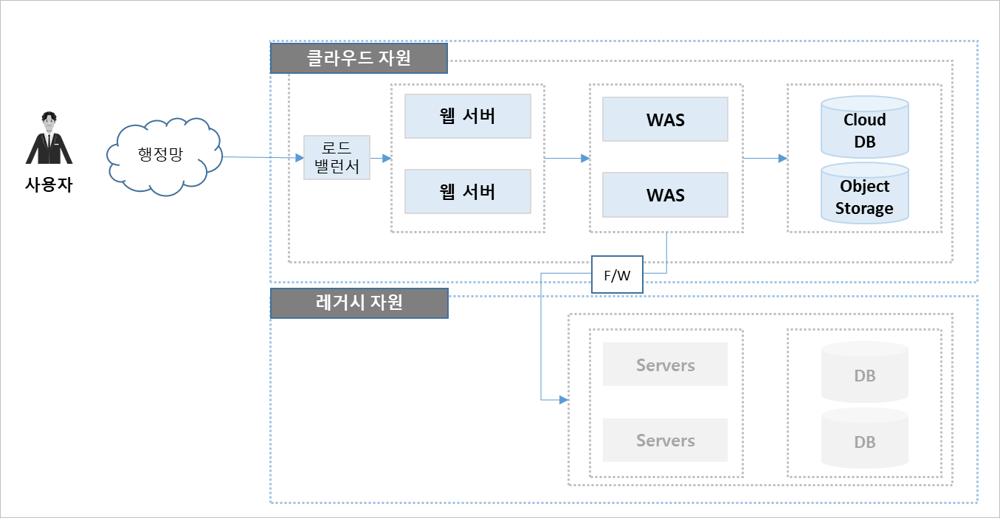

 

**3\) 연관 플랫폼 서비스**

| **구성요소**      | **플랫폼 서비스**                    | **비고** |
| ----------------- | ------------------------------------ | -------- |
| 오픈소스 웹서버   | Nginx(Ubuntu16.04) on OpenStack      |          |
|                   | Apache(Ubuntu 16.04) on OpenStack    |          |
| 오픈소스 WAS 서버 | Tomcat(Ubuntu16.04) on OpenStack     |          |
|                   | JBoss(Ubuntu16.04) on OpenStack      |          |
| 오픈소스 DBMS     | MariaDB(Ubuntu16.04) on OpenStack    |          |
|                   | PostgreSQL(Ubuntu16.04) on OpenStack |          |
| 네트워크          | 로드밸런서                           |          |

  

### 2.8. VM 기반의 APP 개발 시 선택 가능한 서비스 조합

**1\) 아키텍처 소개**

- Ubuntu 환경의 전형적인 WEB, WAS, DB 기반의 어플리케이션 실행 환경으로 메시지 미들웨어나 인메모리 DBMS 등 필요에 따라 추가 서비스 조합이 가능

 

**2\) 아키텍처 구성**

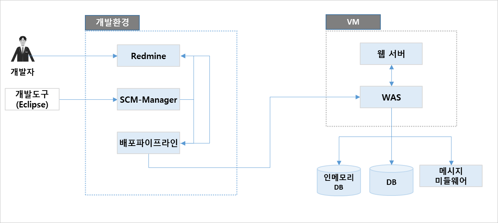

 

**3\) 연관 플랫폼 서비스**

| **구성요소**      | **플랫폼 서비스**                 | **비고** |
| ----------------- | --------------------------------- | -------- |
| 오픈소스 웹서버   | Nginx(Ubuntu16.04) on OpenStack   |          |
|                   | Apache(Ubuntu 16.04) on OpenStack |          |
| 오픈소스 WAS 서버 | Tomcat(Ubuntu16.04) on OpenStack  |          |
|                   | JBoss(Ubuntu16.04) on OpenStack   |          |
| 오픈소스 DBMS     | MariaDB(Ubuntu16.04) on OpenStack |          |
| 프로젝트 관리     | Redmine                           |          |
| 형상관리          | SCM-Manager                       |          |
| CI/CD             | 배포파이프라인                    |          |
| 메시지 미들웨어   | RabbitMQ on OpenStack             |          |
| 인메모리 DBMS     | Redis on OpenStack                |          |

  

### 2.9. CF 기반의 APP 개발 시 선택 가능한 서비스 조합

**1\) 아키텍처 소개**

- CF 컨테이너 기반의 APP 개발 및 실행환경에 필요한 서비스 조합

 

**2\) 아키텍처 구성**

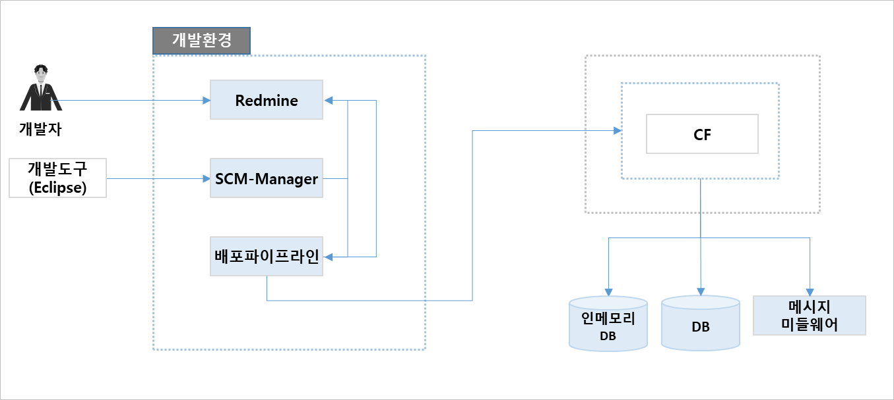

 

**3\) 연관 플랫폼 서비스**

| **구성요소**    | **플랫폼 서비스**                 | **비고** |
| --------------- | --------------------------------- | -------- |
| 프로젝트 관리   | Redmine                           |          |
| 형상관리        | SCM-Manager                       |          |
| CI/CD           | 배포파이프라인                    |          |
| 오픈소스 DBMS   | MariaDB(Ubuntu16.04) on OpenStack |          |
| 메시지 미들웨어 | RabbitMQ on OpenStack             |          |
| 인메모리 DBMS   | Redis on OpenStack                |          |

  

### 2.10. K8s 기반의 APP 개발 시 선택 가능한 서비스 조합

**1\) 아키텍처 소개**

- K8s 컨테이너 기반의 APP 개발 및 실행 환경에 필요한 서비스 조합

 

**2\) 아키텍처 구성**

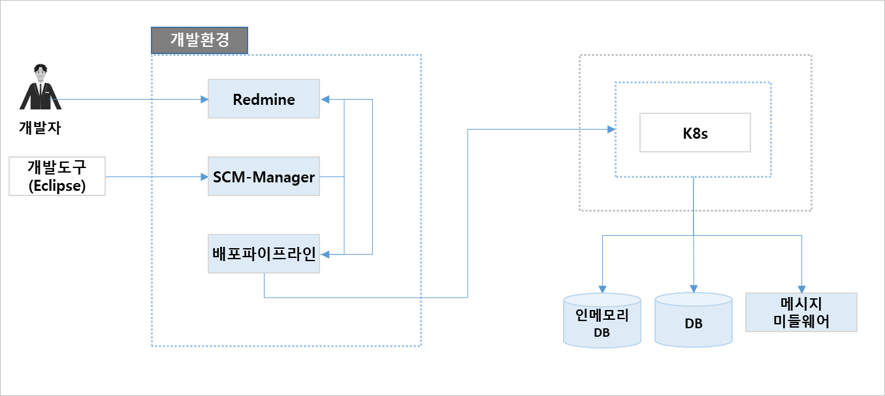

 

**3\) 연관 플랫폼 서비스**

| **구성요소**    | **플랫폼 서비스**                 | **비고** |
| --------------- | --------------------------------- | -------- |
| 프로젝트 관리   | Redmine                           |          |
| 형상관리        | SCM-Manager                       |          |
| CI/CD           | 배포파이프라인                    |          |
| 오픈소스 DBMS   | MariaDB(Ubuntu16.04) on OpenStack |          |
| 메시지 미들웨어 | RabbitMQ on OpenStack             |          |
| 인메모리 DBMS   | Redis on OpenStack                |          |

 

---

## 3. 인공지능 개발환경

### 3.1.  소규모 인공지능 개발환경

**1\) 아키텍처 소개**

- Jupyter Notebook 기반 소규모 인공지능 개발 환경

 

**2\) 아키텍처 구성**

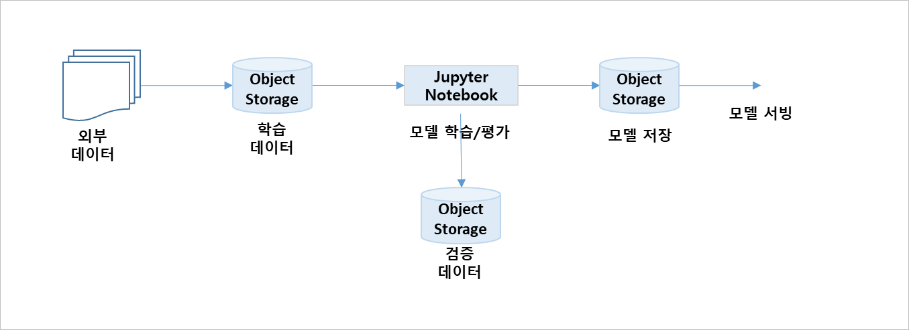

 

**3\) 연관 플랫폼 서비스**

| **구성요소**      | **플랫폼 서비스**           | **비고** |
| ----------------- | --------------------------- | -------- |
| 인공지능 개발환경 | Jupyter Notebook            |          |
| 외부저장소        | Object Storage on OpenStack |          |

  

### 3.2. 인공지능 개발환경

**1\) 아키텍처 소개**

- 상대적으로 큰 규모의 인공지능 개발 환경을 위한 서비스 조합

 

**2\) 아키텍처 구성**

 

**3\) 연관 플랫폼 서비스**

| **구성요소**                        | **플랫폼 서비스**             | **비고** |
| ----------------------------------- | ----------------------------- | -------- |
| 입주기관 단독사용 인공지능 개발환경 | Jupyter Notebook on OpenStack |          |
| 외부저장소                          | Object Storage on OpenStack   |          |

  

### 3.3. 인공지능 음성인식/음성합성 서비스 개발

**1\) 아키텍처 소개**

- Jupyter Notebook 기반 인공지능 개발 환경과 인공지능 음성인식/음성합성 서비스 개발

 

**2\) 아키텍처 구성**

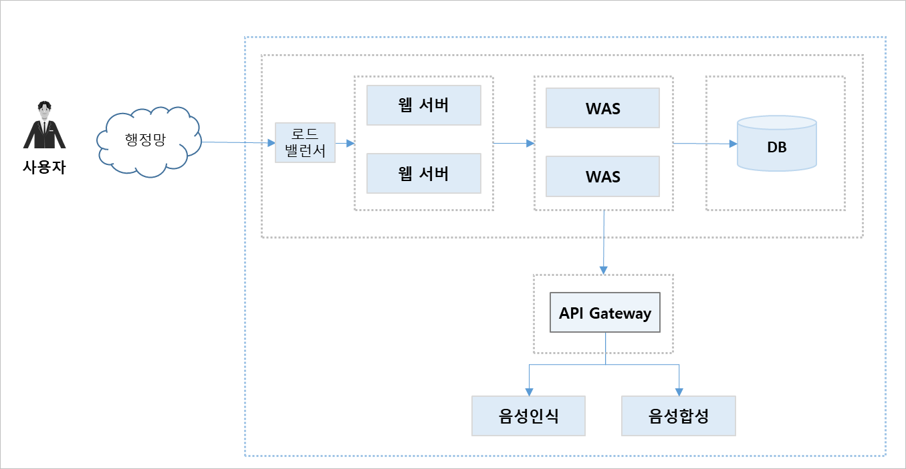

 

**3\) 연관 플랫폼 서비스**

| **구성요소**                 | **플랫폼 서비스**                    | **비고**                                              |
| ---------------------------- | ------------------------------------ | ----------------------------------------------------- |
| 오픈소스 웹서버              | Nginx(Ubuntu16.04) on OpenStack      |                                                       |
|                              | Apache(Ubuntu 16.04) on OpenStack    |                                                       |
| 오픈소스 WAS 서버            | Tomcat(Ubuntu16.04) on OpenStack     |                                                       |
|                              | JBoss(Ubuntu16.04) on OpenStack      |                                                       |
| 오픈소스 DBMS                | MariaDB(Ubuntu16.04) on OpenStack    |                                                       |
|                              | PostgreSQL(Ubuntu16.04) on OpenStack |                                                       |
| 연계서비스                   | API Gateway                          |                                                       |
| 인공지능 음성합성 API 서비스 | 음성합성                             | 문자열을 사람의 목소리로 변환하는 API 서비스          |
| 인공지능 음성인식 API 서비스 | 음성인식                             | 사람의 목소리를 인식하여 문자열로 변환하는 API 서비스 |

  

### 3.4. 인공지능 자연어 처리 서비스 개발

**1\) 아키텍처 소개**

- Jupyter Notebook 기반 인공지능 개발 환경과 인공지능 자연어 처리 개발

 

**2\) 아키텍처 구성**

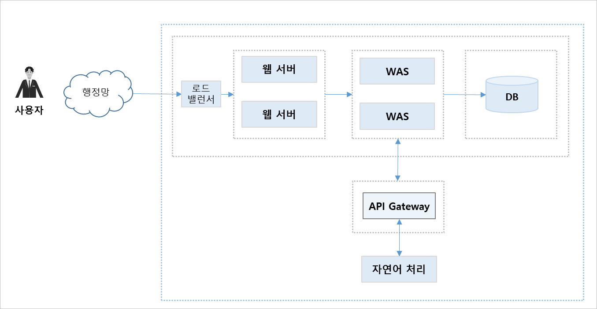

 

**3\) 연관 플랫폼 서비스**

| **구성요소**           | **플랫폼 서비스**                    | **비고** |
| ---------------------- | ------------------------------------ | -------- |
| 오픈소스 웹서버        | Nginx(Ubuntu16.04) on OpenStack      |          |
|                        | Apache(Ubuntu 16.04) on OpenStack    |          |
| 오픈소스 WAS 서버      | Tomcat(Ubuntu16.04) on OpenStack     |          |
|                        | JBoss(Ubuntu16.04) on OpenStack      |          |
| 오픈소스 DBMS          | MariaDB(Ubuntu16.04) on OpenStack    |          |
|                        | PostgreSQL(Ubuntu16.04) on OpenStack |          |
| 연계서비스             | API Gateway                          |          |
| 자연어 분석 API 서비스 | 자연어 분석                          |          |

  

### 3.5. 음성인식을 통한 회의록 자동 작성 시스템

**1\) 아키텍처 소개**

- 인공지능 음성인식 서비스의 실시간 음성인식 기능을 활용하여 회의록 초안 작성 시스템을 구축하기 위한 서비스 조합

 

**2\) 아키텍처 구성**

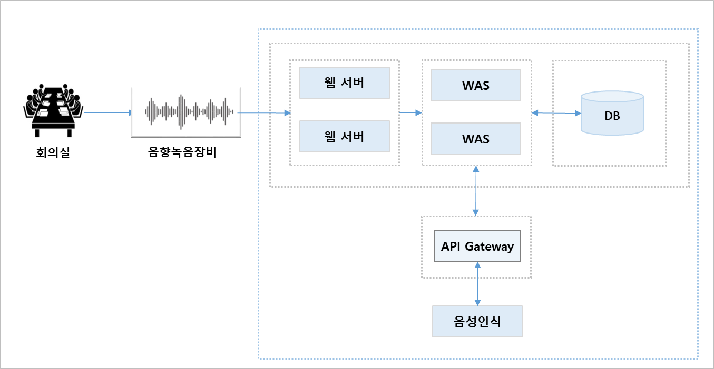

 

**3\) 연관 플랫폼 서비스**

| **구성요소**                 | **플랫폼 서비스**                    | **비고**                                              |
| ---------------------------- | ------------------------------------ | ----------------------------------------------------- |
| 오픈소스 웹서버              | Nginx(Ubuntu16.04) on OpenStack      |                                                       |
|                              | Apache(Ubuntu 16.04) on OpenStack    |                                                       |
| 오픈소스 WAS 서버            | Tomcat(Ubuntu16.04) on OpenStack     |                                                       |
|                              | JBoss(Ubuntu16.04) on OpenStack      |                                                       |
| 오픈소스 DBMS                | MariaDB(Ubuntu16.04) on OpenStack    |                                                       |
|                              | PostgreSQL(Ubuntu16.04) on OpenStack |                                                       |
| 연계서비스                   | API Gateway                          |                                                       |
| 인공지능 음성인식 API 서비스 | 음성인식                             | 사람의 목소리를 인식하여 문자열로 변환하는 API 서비스 |

  

### 3.6. 머신러닝 환경 구축

**1\) 아키텍처 소개**

- 빅데이터 기반으로 패턴 인식과 예측을 수행하는 머신러닝 개발 환경 구축
- 빅데이터를 기반으로 스스로 패턴을 찾아내고, 미래에 대한 예측을 수행하는 형태의 서비스

 

**2\) 아키텍처 구성**

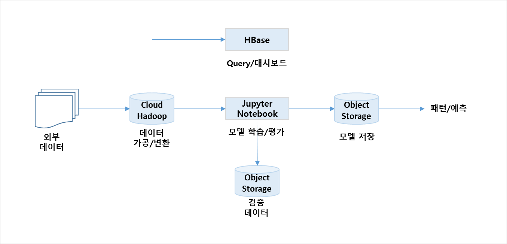

 

**3\) 연관 플랫폼 서비스**

| **구성요소**                        | **플랫폼 서비스**             | **비고** |
| ----------------------------------- | ----------------------------- | -------- |
| 입주기관 단독사용 인공지능 개발환경 | Jupyter Notebook on OpenStack |          |
| 입주기관 단독사용 빅데이터 서비스   | 빅데이터 서비스 on OpenStack  |          |
| 외부저장소                          | Object Storage on OpenStack   |          |

 

---

## 4. 빅데이터 분석환경

### 4.1. 소규모 빅데이터 분석환경

**1\) 아키텍처 소개**

- 소규모 빅데이터 분석에 적합한 환경

 

**2\) 아키텍처 구성**

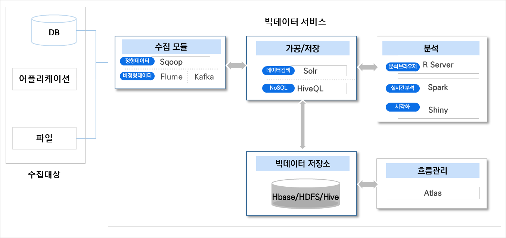

 

**3\) 연관 플랫폼 서비스**

| **구성요소**           | **플랫폼 서비스** | **비고** |
| ---------------------- | ----------------- | -------- |
| 소규모 빅데이터 서비스 | 빅데이터 서비스   |          |

  

### 4.2. 빅데이터 분석환경

**1\) 아키텍처 소개**

- 전문적이고 대규모의 빅데이터 분석을 위한 서비스 환경

 

**2\) 아키텍처 구성**

 

**3\) 연관 플랫폼 서비스**

| **구성요소**                      | **플랫폼 서비스**            | **비고** |
| --------------------------------- | ---------------------------- | -------- |
| 입주기관 단독사용 빅데이터 서비스 | 빅데이터 서비스 on OpenStack |          |

  

### 4.3. 실시간 스트리밍 데이터 분석 환경 구축

**1\) 아키텍처 소개**

- 빅데이터 오픈 소스 프레임워크와 Kafka, Object Storage를 활용한 실시간 빅데이터 분석 환경 구축

 

**2\) 아키텍처 구성**

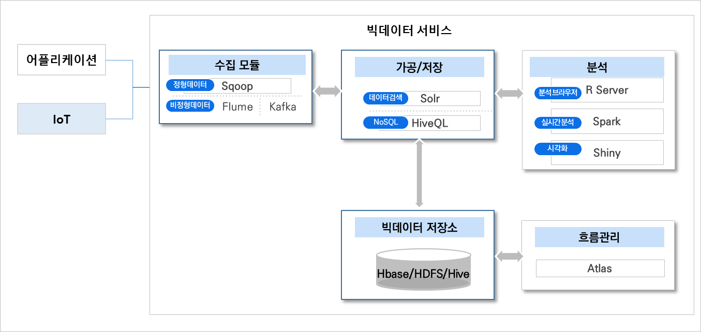

 

**3\) 연관 플랫폼 서비스**

| **구성요소**                      | **플랫폼 서비스**            | **비고** |
| --------------------------------- | ---------------------------- | -------- |
| 입주기관 단독사용 빅데이터 서비스 | 빅데이터 서비스 on OpenStack |          |
| 입주기관 단독사용 IoT 서비스      | IoT 서비스 on K8s            |          |
| 외부저장소                        | Object Storage on OpenStack  |          |

 

---

## 5. IoT 개발환경

### 5.1. 소규모 IoT 개발환경

**1\) 아키텍처 소개**

- 학습 목적이나 비교적 소규모의 IoT 개발환경에 적합한 구성

 

**2\) 아키텍처 구성**

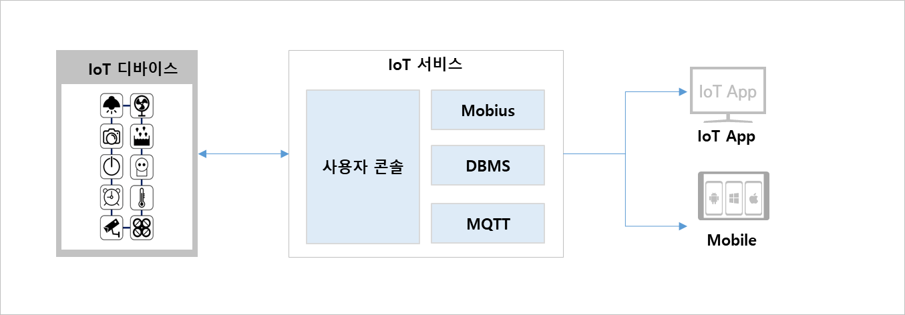

 

**3\) 연관 플랫폼 서비스**

| **구성요소**      | **플랫폼 서비스** | **비고** |
| ----------------- | ----------------- | -------- |
| 소규모 IoT 서비스 | IoT 서비스        |          |

  

### 5.2. IoT 개발환경

**1\) 아키텍처 소개**

- 전문적이고 대규모의 IoT 개발환경 구축에 필요한 서비스 조합

 

**2\) 아키텍처 구성**

 

**3\) 연관 플랫폼 서비스**

| **구성요소**                 | **플랫폼 서비스** | **비고** |
| ---------------------------- | ----------------- | -------- |
| 입주기관 단독사용 IoT 서비스 | IoT 서비스 on K8s |          |

 

---

## 6. IoT-빅데이터 연계

### 6.1. 소규모 IoT-빅데이터 연계 구성

**1\) 아키텍처 소개**

- 소규모의 IoT-빅데이터 연계환경 구성을 위한 조합

 

**2\) 아키텍처 구성**

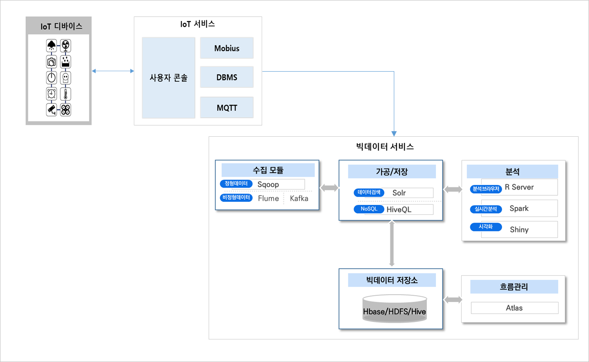

 

**3\) 연관 플랫폼 서비스**

| **구성요소**           | **플랫폼 서비스** | **비고** |
| ---------------------- | ----------------- | -------- |
| 소규모 IoT 서비스      | IoT 서비스        |          |
| 소규모 빅데이터 서비스 | 빅데이터 서비스   |          |

  

### 6.2. IoT-빅데이터 연계 구성

**1\) 아키텍처 소개**

- 전문적이고 대규모의 IoT-빅데이터 연계환경 구축에 필요한 서비스 조합

 

**2\) 아키텍처 구성**

 

**3\) 연관 플랫폼 서비스**

| **구성요소**                      | **플랫폼 서비스**            | **비고** |
| --------------------------------- | ---------------------------- | -------- |
| 입주기관 단독사용 IoT 서비스      | IoT 서비스 on K8s            |          |
| 입주기관 단독사용 빅데이터 서비스 | 빅데이터 서비스 on OpenStack |          |

